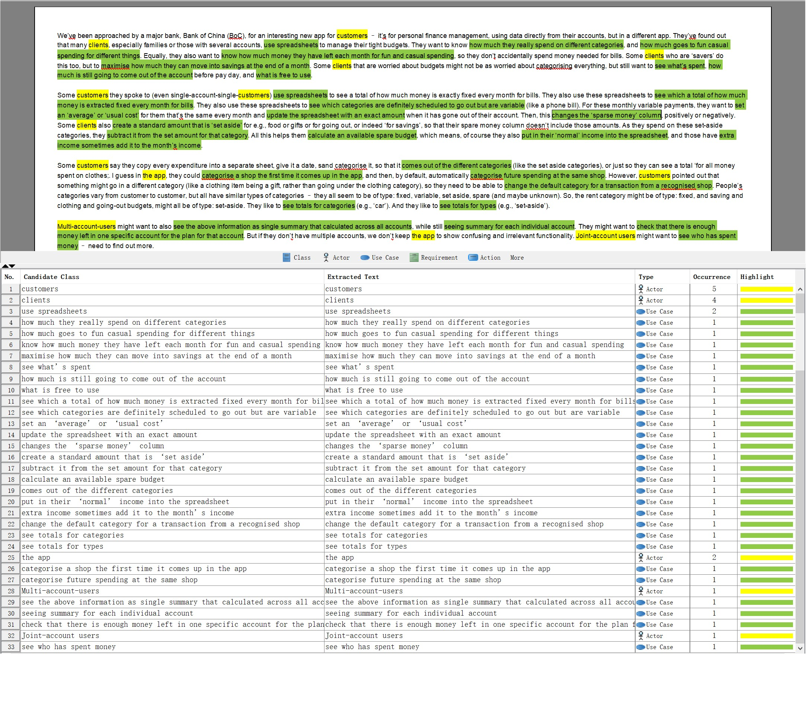
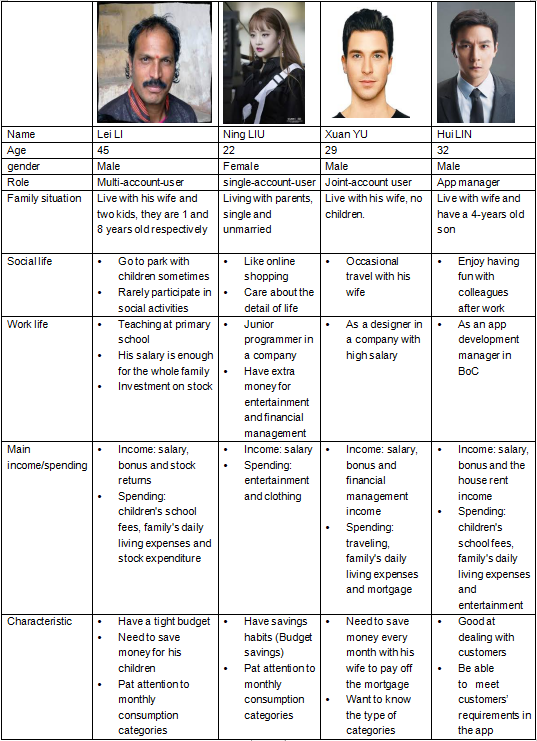
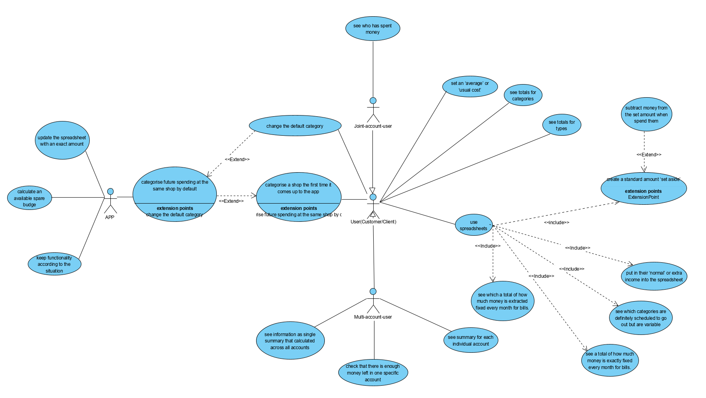

# CW1 - Requirments
_________

## Overview

 The aim of this report is to establish the **requirements** for a piece of software for a prospective client. The first is an **analysis for requirments**. Note that here we use two different colors to mark Actors and Use Case. Afterwards, we use **Personas** to differentiate shakeholder and **Use Case Diagram** to elaborate the tasks each stakeholder do. The reasons why we specifically chose them are explained in their respective modules. The diagram in the report also contains some **conjectures** and **notes worthy of attention**. We hope that they can help you understand the requirments clearly.

__________________

## Table of Contents

 section | description
 -|-
 1 | Textual Analysis
 2 | Personas
 3 | Use Case Diagram
 4 | Question and Assumption

___________________

## Textual Analysis

 This is a basic part we build to analysis the requirments, we use **yellow to mark Actors**, use **green to mark Use Case**. Textual Analysis plays 
 a key role in making Personas and User Case Diagram. We use **actors** that appear in Textual Analysis to be part of stakeholds to **help us making Personas**. Also, **actors** and **use case** in the table **make the roads for us to make User Case Diagram.**
  
 Here are something to note:

- Both customers and client represent normal users, multi-account users, joint-account user as special users
- Use Case 29, 30 and 31 is only for multi-account users and 33 is only for joint-account users(Can be seen more clearly in User Case Diagram)

___________________

## Personas

A persona represents a **real type of user** from the stakeholders. In this project, we used **different prototypes** in persona to **differentiate stakeholders**. We selected four people to represent four prototypes relevant to this software. Those who have **multi-accounts**, **single accounts**, **joint-accounts** and an **App managers**. The analysis of 45-year-old multi-account-user Lei Li, 22-year-old single-account-user Ning LIU and 29-year-old Joint-account-user Xuan YU can mainly represent the motivation and targets for the **primary holder**, who will use the app directly. Due to the particularity of the Joint-account, our third character Xuan YU acts as the **primary stakeholder** at the same time as a **secondary stakeholder** who is indirectly affected by the software. That is, when her husband, who joins her account, becomes a direct user of the software primary, he acts as a secondary stakeholder.The last character, the App manager Hui LIN, is a representation of a **tertiary stakeholder**. Analyzing his information may help us better understand the tertiary stakeholder’s expectation of this App. 

### Why we choose it?
- This analysis represents the **interests** and **requirements** of different people in a more concrete and visual way 
- Helps us put ourselves in the shoes of different types of users in order to **think more carefully** about users' needs.
- This text contains **too many different requirments**, and if looking directly at Use Case Diagram or Use Stories may be **harder to understand** as the program's developer, the Personas can help them first to **make an understanding of different type of users** they will face in advance.

___________________

## Use Case Diagram

User Data Diagram create a ‘use case’ for **all the main tasks** that different types of users can do. In this user case diagram, we create four types of actors: App, Joint-account user, Multi-account-user and normal user. The joint-account user and multi-account user are **special case of user** and the normal user is the normal case of user. The requirments of the normal users are **also the requirments of all users(include special users)**, however, the requirments of the special users are **specific to themself**.

### Why we choose it?
- We use Personas to give an idea of **user's character**, developer may has a certain understanding of the user and then we need Use Case Diagram to let developer to **elaborate the tasks each stakeholder do**
- Compared to User Stories, diagram is more **intuitive** and **readable**. It capturing the **functional requirements** of the system and traceable. Use cases are more **easily understandable** by business users. The requirments of the normal users are also the requirments of all users(include special).

___________________

## Question and Assumption

question: 

- Q1. When the App is expected to be released?
- Q2. What is the budget for the App development?
- Q3. Which platform will be launched first?
- Q4. Will it do public beta launch?
- Q5. Who would be beta users?

Assumption: 
We assume that the main user of this App is 18-60 years old people. The reason is a child under the age of 18 needs a guardian to open an account in a bank, and adults usually help them to manage their account. As for the old people, they may not good at using Apps.
_____

[back to previous page](../README.md)

[see the requirement](../docs/cw2.md)
