# Specification

> authors: Xi Yu, Hudie Liu, Yuhua Guo, Wendi Han, Xue Li, 
> Pui Cheng   data: 2020/4/9 

## Overview

The aim of this report is to establish the **specification** according to the requirement(e.g. UCD). If you want to see the requiement click [here](../docs/cw1.md) The first is an **prototype and scenario**. We choose to put them together because some action can be **well combined** with the figures in the prototype. Also, the sub-image of prototype is shown in the Appendix 1, which is convenient for users to check clearly. Afterwards, we use **activity diagram** to connect the previous actions and other achievable operations together.

__________________

## Table of Contents

 section | description
 -|-
 part 1 | Integration of Diagrams
 part 2 | prototype and Scenario
 part 3 | Activity diagram
 Appendix 1 | sub-images of prototype

___________________

## Integration of Diagrams

 There are some close and clear connections between different diagrams.

 - Firstly, there is a close connection between the prototype and the scenario.Each scenario. Each actions in the scenario can be clearly reflected through the prototype. For instance, when you see "She can find her spending record in the detail part and click the "+" behind that spending record." alone, you might complain, where did this "+" mean or appear?????. However, if you see the "image 5 in the prototype" and track it in the prototype. You can clearly understand the meaning of "+" and how to operate it.
 - Also, When you look at the prototype and activity diagram, you will find that they have many corresponding places. For instance, when you see "register" action and then see the prototype images 1, you may find "Wow, this is our landing page, the things that need to be filled are also very clear". And if you notice "view all account summary", then see the prototype images 2. You might sigh "they are arranged like this, too simple!!!".
 - Prototype and activity diagram are also closely connected, and you can read and understand each step more conveniently

____________________

## Prototype and Scenario

### prototype
The process of manufacturing a product involves various steps to reach a level where it can be brought to the mass market. Our product has a specific target audience.  In order to evaluate whether the product really solves the user's problem, to understand the exact needs and expectations of our target audience, we created a prototype. Our prototype is an early iteration of the product, demonstrating its core functionality.  Prototyping not only providing a strong visual effects for the design to understand the look and feel of the final product, but also help our team better understand our design goals, design content, and design objects.
 

- Image 1: It is the login page. Users can login to the app by entering User Name and Passwords. The app can automatically recognize whether the user is a multi-account client. If the user is a multi-account client, the interface will jump to the multi-account page (image 2). And if the user is a multi-account client, it will go to image 3. 
- Image 2: Multi-account users can see all accounts summary and they can click the “+” to see the summary for individual account. To see the detailed information about a specific account, click see detail and the interface will jump to the image 3.

- Image 3: This is the detail page for selected account. By default, users can see specific information in this month: the total amount of expense and income, a bar chart showing the classification of expenditure and two pie charts which represent fixed expense set amount and fixed set-aside set amount respectively. The month time can be switched by the options at the top of the screen. Clicking on the icon in the upper left corner will jump to image 4, menu options will be shown.

- Image 4: Two options are shown. Users can click ‘Shop Category’ to go to image 5 to see content or click ‘Record’ to jump to image 8 to see detailed recording of expense and income.

- Image 5: This page has two different part: Shop and Detail. In the shop part, users can see the category of the specific shop which is automatically classified by the app. If user clicks the "+" in the shop part to change the category, the interface will jump to image 7. In the detail part, users can get through all spending records in category. If user clicks the "+" in the detail part to change the category, the interface will jump to image 6.
- Image 6: User can search for specific spending records in the search bar and click the radio button to change the category of that spending.
- Image 7: User can search for the shop name in the search bar and click the radio button to change the category of the shop. If the shop category change, all the spending records in that shop will change.
- Image 8: The income and spending in that month are shown before the detail item. Joint-account users can see who spend or get the money clearly behind each record. On the top of the page, user can choose to view the analyze in that month.
- Image 9: The clients can see two pie charts which show the percentage of the income and spending of different users separately. The detail information is shown below.

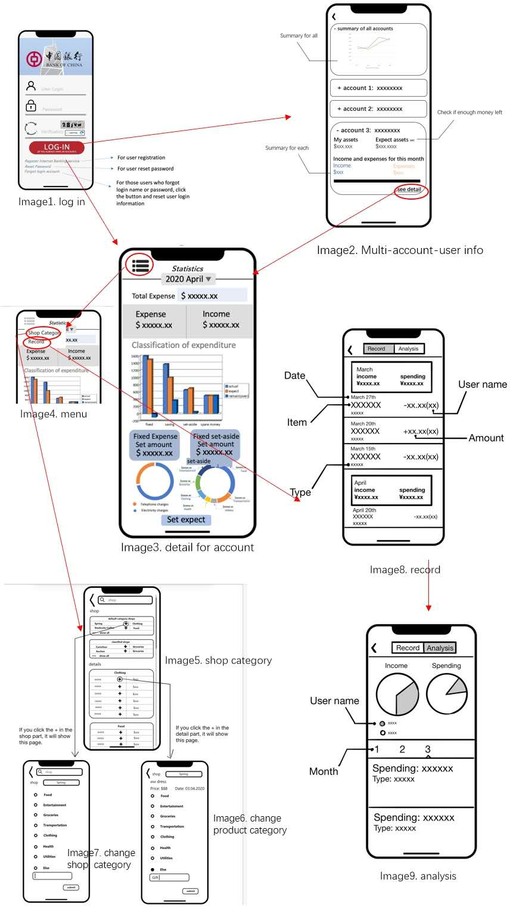

### Scenario: why we choose

- We believe that a structural description of a process is more conducive to us from the perspective of the user to experience the availability of the application.
- Scenarios are easier to understand than sequence diagrams and are also more helpful in understanding the user's requirement.
- Scenario is more useful for engineers to find and improve the lack after implementation. For example, when we simulated a married woman (joint-account user) to look at a spender, we found other income and expenditure problems (i.e. whose income interest belongs to).

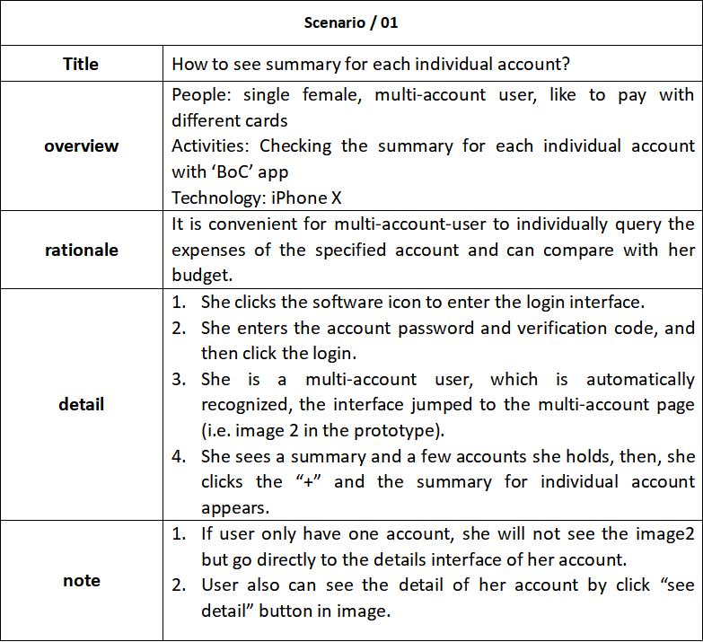

 

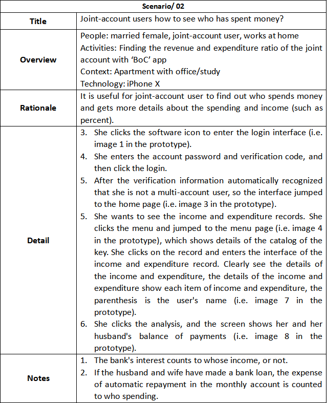

 

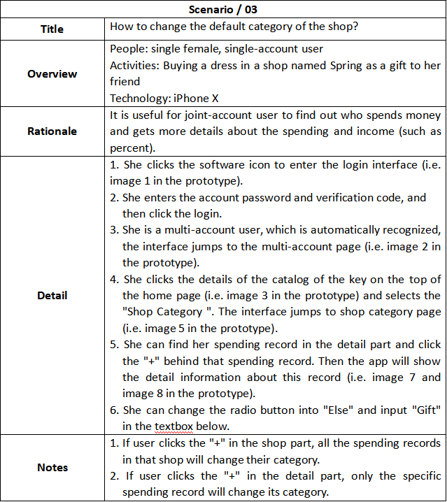

 

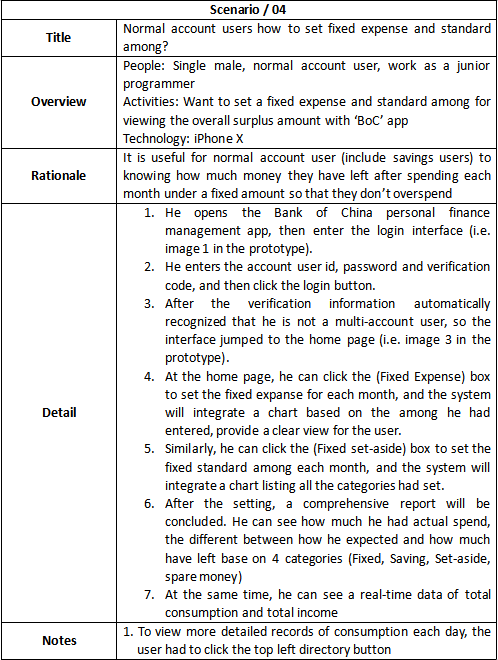
___________________

## Activity diagram

> We choose to use activity diagram to help you understand **the process of viewing** and **manage your financial information** by using our App. 

 

- Activity diagram is used to elaborate workflows for key activities – especially if they involve decisions. When using this app, several choices and activities would be involved.
- It tied several Use Cases for the bigger process as follows: 
 Firstly, if you don’t have the App account, you could register one (action: register) and bind to your bank account. If you already have the App account, it’s quite convenient to sign in (action: sign in) directly.  Secondly, you can choose account to do the following operations. If you are a multi-account user, you could view account summery for all or for each (action: view all account summery; view single account summery; check adequate balance for single account).  If you want to view details, you could do the following steps as single account users. There are several choices for you. You could see totals for categories and types, view total expense and income, etc. (action: see totals for categories and types, view total expense and income, view classification of expenditure, set 'average' or 'usual cost' and create a standard amount 'set aside'; it’s up to your choice.)  After that, if you are a joint account user, there’s a choice for you to view other user’s expenditure information (action: view user name and expenditure information such as date and type; view the percentage of each user 's income and spending).  If you are not, however, or you just want to do some record or settings to certain account, there’re other options for you: you can add expense or income, (action: add expense in certain categories; put all income into the spreadsheet) and category the shop in first set for future using. (action: categories a shop the first time it comes up to the app)  Also, change the default category is allowed. (action: change the default categories) If all operations are done, you could leave the app. (action: end) Throughout this activity diagram, it clearly shows the step-by-step actions for different personas to use this clean and effective fortune manage app. The whole process is simple but useful, and all the high efficiency can be shown on this diagram.

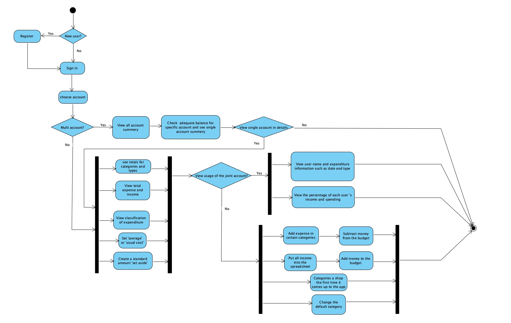
___________________

## Appendix 1

Here are each images of the prototype. 

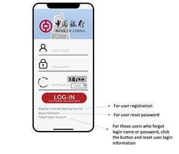
Image1. log in
  

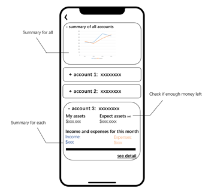
Image2. Multi-account-user info
  

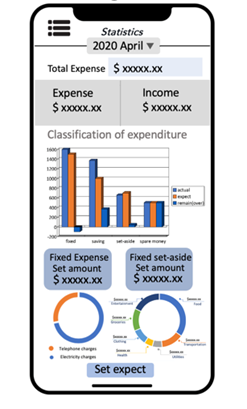
Image3. detail for account
  
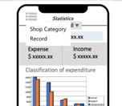
Image4. menu
  
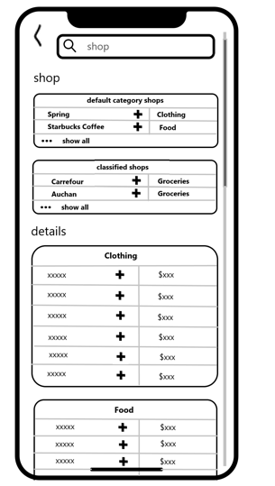
Image5. shop category
  
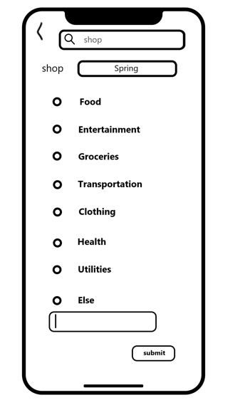
Image6. change product category
  
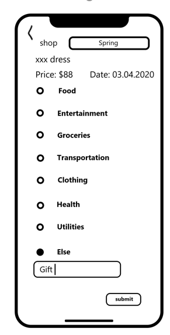
Image7. change shop  category
  
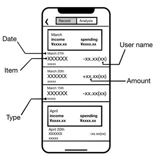
Image8. record
  
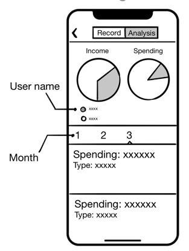
Image9. analysis
  
__________________

[back to previous page](../README.md)

