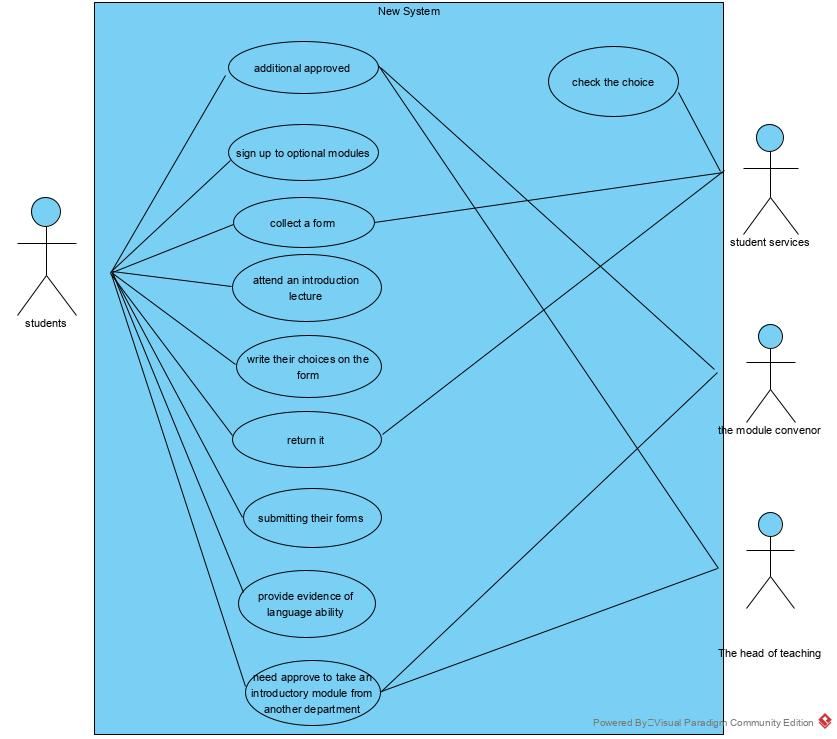

# Personas-Use-Case-Diagram

# Overview

This report contains all the parts of the experiment.
includes:
 1. [Personas](#personas)
 2. [Use-Case Diagram](#usercase)

Personas contains eight different aspect: Photo, Name, Age, Nationality, Job, Tasks, Time at work or study per week and Character. 
Through these aspects, designer can better understand the personas as real people. This helps designer create a baseline about what certain personas will do 
when confronted with different tasks on your software and make sure that navigation paths, or "user flows," are correctly optimized for users to easily move through your site.

Use-Case Diagram can be a extension of a task. What each actors should do.

___________________

# Pensonas{#personas}

This contains eight different aspect: Photo, Name, Age, Nationality, Job, Tasks, Time at work or study per week and Character. 

 <table>
	<tr>
		<td></td>
		<th>  </th> 
		<th>  </th>
		<th>  </th>
		<th>  </th>
	</tr>
	<tr>
		<td> Name </td>
		<th>Pushpendu </th>
		<th> Tony </th>
		<th> Heng Yu </th>
		<th> Prapa </th>
	</tr>
	<tr>
		<td> age </td>
		<th> 22 </th>
		<th> 35 </th>
		<th> 32	</th>
		<th> 30 </th>
	</tr>
	<tr>
		<td> nationality </td>
		<th> India </th> 
		<th> British </th>
		<th> China </th>
		<th> Thailand </th>
	</tr>
	<tr>
		<td> job </td>
		<th> Students </th>
		<th> Student serves </th>
		<th>Module convenor </th>
		<th> Head of teaching </th>
	</tr>
	<tr> 
		<td> tasks </td>
		<th> 
			<ul>
				<li> Optionally attend an introduction lecture </li>
				<li> Write choices on the form </li>
				<li> Need collect approval when special condition occur(i.e. need 50-70 credit split) </li>
			</ul>
		</th>
		<th>
			<ul>
				<li> Check student’s choice form </li>	
				<li> Check the approval student’s send when student have special requirement </li>
			</ul>
		</th>
		<th>
			<ul>
				<li> Collecting the size of each class and each student has pre-require learning or not </li>
				<li> According to the first tasks to give approval when students wish to take an modules which need be required </li>
				<li> According to the first tasks to give approval when students wish to take an introductory module from another department </li>
			</ul>
		</th>
		<th>
			<ul>
				<li> Distribute the teaching tasks</li>
				<li> Give approval when students wish to take an introductory module from another department</li>
			</ul>
		</th>
	</tr>
	<tr>
		<td> Time at work or study per week</td>
		<th> 35-40 hours </th>
		<th> 25 hours </th>
		<th> 23 hours </th>
		<th> 30 hours </th>
	</tr>
	<tr>
		<td> characteristic </td>
		<th>
			<ul> 
				<li> Outstanding students </li>
				<li> Rarely play game </li>
			</ul>
		</th>
		<th>
			<ul>
				<li> Patient, however, need to handle the demand from a large number of students</li>
				<li> Need concise and intuitive software to help working</li>
			</ul>
		</th>
		<th>
			<ul>
				<li> A quick temper </li>
				<li> Can quickly master the operation of different procedures </li>
				<li> Need software to have a clear classification </li>
			</ul>
		</th>
		<th>
			<ul>
				<li> The first year to become the head of teaching </li>
				<li> Have too many things to do and less time handle the requirment </li>
			</ul>
		</th>
	</tr>
</table>

____________________

# Use-Case Diagram{#usercase}

[Back to the Previous page](../README.md)