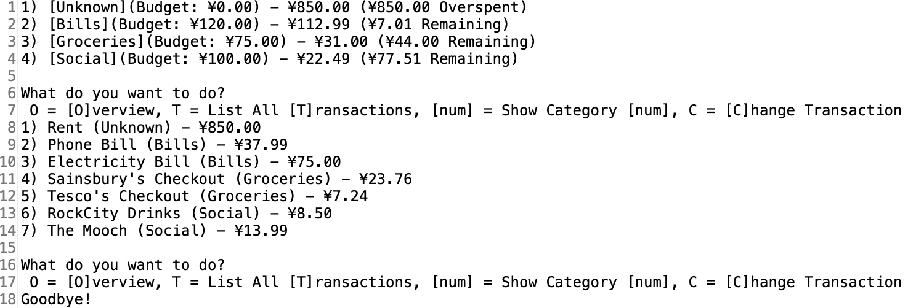
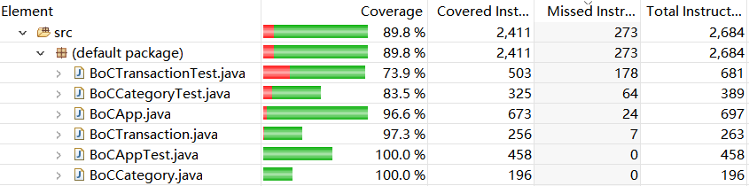

# Test Plan (and eventually Test Report) - Example Template

| Contents                            |
| ----------------------------------- |
| [Team Management](#team-management) |
| [Test Plan](#test-plan)             |
| [Code Modify](#code-modify)         |
| [Coverage](#coverage)   |
| [Log](#log)              |


## Team Management

#### Time Table

> The person in the form is the main person in charge of the task, others are responsible for assisting with the task during this period.


## Test Plan

> contributer: Xi Yu, Xue Li, Pui Yee CHENG
> date: 2020/5/6(last modify)

### Class: BoCTransaction

#### Function: public BoCTransaction()
##### Before Code Modify
| Test | Inputs | Expected Outcome | Test Outcome | Description | Result |
| ---- | ------ | ---------------- | ------------ | ----------- | ------ |
| void testBoCTransaction1()| null | transactionName = null<br/>transactionValue = null<br/>transactionTime = null<br/>transactionCategory = 0	| transactionName = null<br/>transactionValue = null<br/>transactionTime = null<br/>transactionCategory = 0	| Test if the default constructor works | Pass 		|

##### After Code Modify
| Test | Inputs | Expected Outcome | Test Outcome | Description | Result |
| ---- | ------ | ---------------- | ------------ | ----------- | ------ |
| void testBoCTransaction1()| null | transactionName = null<br/>transactionValue = null<br/>transactionTime = null<br/>transactionCategory = 0	| transactionName = null<br/>transactionValue = null<br/>transactionTime = null<br/>transactionCategory = 0	| A re-test after modify | Pass 		|


#### Function: public BoCTransaction(String tName, BigDecimal tValue, int tCat)
##### Before Code Modify
| Test | Inputs | Expected Outcome | Test Outcome | Description | Result |
| ---- | ------ | ---------------- | ------------ | ----------- | ------ |
| void testBoCTransaction2()| "testName" | transactionName = "testName"<br/>transactionValue = 850<br/>transactionTime = Mon May 01 00:53:14 HKT 2020<br/>transactionCategory = 1	| transactionName = "testName"<br/>transactionValue = 850<br/>transactionTime = Mon May 01 00:53:14 HKT 2020<br/>transactionCategory = 1	| Test if the  constructor(with parameter) works | Pass 		|

##### After Code Modify
| Test | Inputs | Expected Outcome | Test Outcome | Description | Result |
| ---- | ------ | ---------------- | ------------ | ----------- | ------ |
| void testBoCTransaction2()| "testName" | transactionName = "testName"<br/>transactionValue = 850<br/>transactionTime = Mon May 01 00:53:14 HKT 2020<br/>transactionCategory = 1	| transactionName = "testName"<br/>transactionValue = 850<br/>transactionTime = Mon May 01 00:53:14 HKT 2020<br/>transactionCategory = 1	| A re-test after modify | Pass 		|

#### Function: public String transactionName()
##### Before Code Modify
| Test | Inputs | Expected Outcome | Test Outcome | Description | Result |
| ---- | ------ | ---------------- | ------------ | ----------- | ------ |
| void testTransactionName()| BoCTransaction<br />("testName",850.00,1) | "testName"	| testName 	| Test the function transactionName() with input BoCTransaction("testName",850.00,1) to see if it work normally| Pass 		|

##### After Code Modify
| Test | Inputs | Expected Outcome | Test Outcome | Description | Result |
| ---- | ------ | ---------------- | ------------ | ----------- | ------ |
| void testTransactionName()| BoCTransaction<br />("testName",850.00,1) | "testName"	| testName 	| A re-test after modify | Pass 		|

#### Function: public BigDecimal transactionValue()
##### Before Code Modify
| Test | Inputs | Expected Outcome | Test Outcome | Description | Result |
| ---- | ------ | ---------------- | ------------ | ----------- | ------ |
| void testTransactionValue()| BoCTransaction<br />("testName",850.00,1) | 850	| 850 	| Test the function transactionValue() with input BoCTransaction("testName",850.00,1) to see if it work normally| Pass 		|

##### After Code Modify
| Test | Inputs | Expected Outcome | Test Outcome | Description | Result |
| ---- | ------ | ---------------- | ------------ | ----------- | ------ |
| void testTransactionValue()| BoCTransaction<br />("testName",850.00,1) | 850	| 850 	| A re-test after modify | Pass 		|

#### Function: public int transactionCategory()
##### Before Code Modify
| Test | Inputs | Expected Outcome | Test Outcome | Description | Result |
| ---- | ------ | ---------------- | ------------ | ----------- | ------ |
| void testTransactionCategory()| BoCTransaction<br />("testName",850.00,1) | 1	| 1 	| Test the function transactionCategory() with input BoCTransaction("testName",850.00,1) to see if it work normally| Pass 		|

##### After Code Modify
| Test | Inputs | Expected Outcome | Test Outcome | Description | Result |
| ---- | ------ | ---------------- | ------------ | ----------- | ------ |
| void testTransactionCategory()| BoCTransaction<br />("testName",850.00,1) | 1	| 1 	| A re-test after modify | Pass 		|

#### Function: public Date transactionTime()
##### Before Code Modify
| Test | Inputs | Expected Outcome | Test Outcome | Description | Result |
| ---- | ------ | ---------------- | ------------ | ----------- | ------ |
| void testTransactionTime()| BoCTransaction<br />("testName",850.00,1) <br/> + <br/> new Date() | Mon May 01 00:53:14 HKT 2020	| Mon May 01 00:53:14 HKT 2020 	| Test the function transactionTime() with tTime = new Date() to see if it work normally| Pass 		|

##### After Code Modify
| Test | Inputs | Expected Outcome | Test Outcome | Description | Result |
| ---- | ------ | ---------------- | ------------ | ----------- | ------ |
| void testTransactionTime()| BoCTransaction<br />("testName",850.00,1) <br/> + <br/> new Date() | Mon May 01 00:53:14 HKT 2020	| Mon May 01 00:53:14 HKT 2020 	| A re-test after modify | Pass 		|


#### Function: void setTransactionName(String tName)
##### Before Code Modify
| Test | Inputs | Expected Outcome | Test Outcome | Description | Result |
| ---- | ------ | ---------------- | ------------ | ----------- | ------ |
| void testSetTransactionName1() | BoCTransaction() <br />+<br />"changedName" | transactionName = "changedName" | transactionName = "changedName" | Test if function works in normal case. | Pass 	|
| void testSetTransactionName2Before() | BoCTransaction() <br />+<br />null	| catch Exception and return | fail with "It should have exception" | We expected an exception(about cannot set to null) got caught but it fail. Both test code and function setTransactionName() will be modified	| Fail	|
| void<br />testSetTransactionName3() | BoCTransaction() <br />+<br />"aNameOver25Words<br />WhichShouldBeInvalid"	| transactionName = "aNameOver25WordsWhichShou" | transactionName = "aNameOver25WordsWhichShouldBeInvalid"	| We expected the transactionName got length will cut to 25 but fail. Function setTransactionName() will be modified	| Fail	|
| void testSetTransactionName4Before() | BoCTransaction<br />("testName",850.00,1)<br />+<br />"changedName"	| catch Exception and return | fail with "It should have exception"	| We expected an exception (about cannot set again) got caught but fail. Both test code and function setTransactionName() will be modified	| Fail	|
| void testSetTransactionName5Before() | BoCTransaction<br />("changeName",null,1)<br />+<br />"changedName"	| catch Exception and return | fail with "It should have exception"	| We expected an exception (about cannot set again) got caught but fail. Both test code and function setTransactionName() will be modified	| Fail	|


##### After Code Modify
| Test | Inputs | Expected Outcome | Test Outcome | Description | Result |
| ---- | ------ | ---------------- | ------------ | ----------- | ------ |
| void testSetTransactionName1() | BoCTransaction() <br />+<br />"changedName"	| transactionName = "changedName"	| transactionName = "changedName" | A re-test after modify            															| Pass  	|
| void testSetTransactionName2() | BoCTransaction() <br />+<br />null	| Exception message: "Name cannot set to null"	| Exception message: "Name cannot set to null" | A re-test after modify. It is expected an exception will be caught with error message			| Pass		|
| void testSetTransactionName3() | BoCTransaction() <br />+<br />"aNameOver25Words<br />WhichShouldBeInvalid"	| transactionName = "aNameOver25WordsWhichShou"	| transactionName = "aNameOver25WordsWhichShou" | A re-test after modify. It is expected the transactionName() will be shorten to length = 25	| Pass		|
| void testSetTransactionName4() | BoCTransaction<br />("testName",850.00,1)<br />+<br />"changedName"	| Exception message : "Name cannot be set"	| Exception message : "Name cannot be set"      | A re-test after modify. It is expected an exception will be caught with error message	| Pass		|
| void testSetTransactionName5() | BoCTransaction<br />("changeName",null,1)<br />+<br />"changedName"	| Exception message : "Name cannot be set"	| Exception message : "Name cannot be set" | A re-test after modify. It is expected an exception will be caught with error message			| Pass		|

#### Function: void setTransactionValue(BigDecimal tValue)
##### Before Code Modify
| Test | Inputs | Expected Outcome | Test Outcome | Description | Result |
| ---- | ------ | ---------------- | ------------ | ----------- | ------ |
| void<br />testSetTransactionValue1() | BoCTransaction()<br />+<br />800.00	| transaction value =800.00	| transaction value =800.00 | Test if function works in normal case.	| Pass		|
| void testSetTransactionValue2Before() | BoCTransaction<br />("testName",850.00,1)<br />+<br />800.00	| catch Exception and return | fail with "It should have exception" | We expected an exception(about value cannot be set) got caught but fail. Both test code and function setTransactionValue() will be modified	| Fail		|
| void testSetTransactionValue3Before() | BoCTransaction()<br />+<br />-800.00	| catch Exception and return | fail with "It should have exception" | We expected an exception(about value cannot set to negative) got caught but fail. Both test code and function setTransactionValue() will be modified	| Fail		|
| void testSetTransactionValue4Before() | BoCTransaction()<br />+<br />null	| catch Exception and return | fail with "It should have exception" | Test function setTransactionValue() with set it to null and expect an exception is caught | Fail	|
| void testSetTransactionValue5Before() | BoCTransaction<br />(null,850.00,1)<br />+<br />800.00	| catch Exception and return | fail with "It should have exception" | We expected an exception(about value cannot be set) got caught but fail. Both test code and function setTransactionValue() will be modified | Fail	|


##### After Code Modify
| Test | Inputs | Expected Outcome | Test Outcome | Description | Result |
| ---- | ------ | ---------------- | ------------ | ----------- | ------ |
| void testSetTransactionValue1()     	| BoCTransaction()<br />+<br />800.00	| transaction value =800.00	| transaction value =800.00 | A re-test after modify														|  Pass   	|
| void testSetTransactionValue2()     	| BoCTransaction<br />("testName",850.00,1)<br />+<br />800.00	| Exception message : "Value cannot be set"	| Exception message : "Value cannot be set" | A re-test after modify. It is expected an exception will be caught with error message |  Pass		|
| void testSetTransactionValue3()     	| BoCTransaction()<br />+<br />-800.00	| Exception message : "Value should be positive"	| Exception message : "Value should be positive" | A re-test after modify. It is expected an exception will be caught with error message	|  Pass		|
| void testSetTransactionValue4()     	| BoCTransaction()<br />+<br />null	| Exception message : "Can not be set to null"	| Exception message : "Can not be set to null" | A re-test after modify. It is expected an exception will be caught with error message	|  Pass		|
| void testSetTransactionValue5()     	| BoCTransaction<br />(null,800.00,1)	| Exception message : "Value cannot be set"	| Exception message : "Value cannot be set" | A re-test after modify. It is expected an exception will be caught with error message	|  Pass		|

#### Function: void setTransactionCategory(int tCat)
##### Before Code Modify
| Test | Inputs | Expected Outcome | Test Outcome | Description | Result |
| ---- | ------ | ---------------- | ------------ | ----------- | ------ |
| void testSetTransactionCategory1()   	   | BoCTransaction()<br />+<br /> 1 | transaction category = 1 | transaction category = 1 | Test function setTransactionCategory(int tCat) with tCat = 1																													| Pass   |
| void testSetTransactionCategory2()   	   | BoCTransaction<br />("testName",850.00,1)<br />+<br />2 | transaction category = 2 | transaction category = 2 | Test function setTransactionCategory(int tCat) with tCat = 2																													| Pass   |
| void testSetTransactionCategory3Before() | BoCTransaction()<br />+<br />-3 | catch (Exception e) | fail: It should have exception | Test function setTransactionCategory(int tCat) with tCat = -1. It is expected and exception got caught due to negative category but fail. The code and test will be modified	| Fail   |


##### After Code Modify
| Test | Inputs | Expected Outcome | Test Outcome | Description | Result |
| ---- | ------ | ---------------- | ------------ | ----------- | ------ |
| void testSetTransactionCategory1()   	| BoCTransaction()<br />+<br /> 1 | transaction category = 1  | transaction category = 1    | A re-test after modify            																	|  Pass  |
| void testSetTransactionCategory2()   	| BoCTransaction<br />("testName",850.00,1)<br />+<br />2 | transaction category = 2  | transaction category = 2    | A re-test after modify            																	|  Pass  |
| void testSetTransactionCategory3()   	| BoCTransaction()<br />+<br />-3 | Exception message : "Category cannot be negative" | Exception message : "Category cannot be negative" | A re-test after modify. An exception should be caught with error message if the category is negative	|  Pass  |

#### Function: int isComplete()
##### After Code Modify, it is a new function 
| Test | Inputs | Expected Outcome | Test Outcome | Description | Result |
| ---- | ------ | ---------------- | ------------ | ----------- | ------ |
| void testIsComplete1() | BoCTransaction()										| 0					| 0				| Test function "isComplete()" with transactionName == null && transactionValue == null									| Pass		|
| void testIsComplete2() | BoCTransaction<br />(null,850.00,1)	| 2					| 2				| Test function "isComplete()" with transactionName == null && transactionValue != null									| Pass		|
| void testIsComplete3() | BoCTransaction<br />("testName",null,1)	| 3					| 3				| Test function "isComplete()" with transactionValue == null &&transactionName != null									| Pass		|
| void testIsComplete4() | BoCTransaction<br />("testName",850.00,1)	| 1					| 1				| Test function "isComplete()" with transactionName != null && transactionValue != null && transactionCategory != null	| Pass		|

#### Function: String toString()
##### Before Code Modify
| Test | Inputs | Expected Outcome | Test Outcome | Description | Result |
| ---- | ------ | ---------------- | ------------ | ----------- | ------ |
| testToString1()	| BoCTransaction<br />("testName",850.00,1)	| "testName - ¥850.00 date: Mon May 04 00:53:14 HKT 2020"	| testName - ¥850.00   | Test function "toString" with specified input values 			| Fail   |
| testToString2()	| BoCTransaction<br />("testName",null,1)	| "testName - ¥ unset date: Mon May 04 00:53:14 HKT 2020"	| NullPointerException | Test function "toString" with BoCTransaction("testName",null,1)| Fail   |
| testToString3()	| BoCTransaction()						| unset - ¥ unset  date:  unset                     	| NullPointerException | Test function "toString" with BoCTransaction()					| Fail   |
| testToString4()	| BoCTransaction<br />(null,850.00,1)	| unset - ¥850.00 date: Mon May 04 00:53:14 HKT 2020	| null - ¥850.00       | Test function "toString" with BoCTransaction(null,850.00,1)	| Fail   |

##### After Code Modify
| Test | Inputs | Expected Outcome | Test Outcome | Description | Result |
| ---- | ------ | ---------------- | ------------ | ----------- | ------ |
| testToString1()	| BoCTransaction<br />("testName",850.00,1)	| testName - ¥850.00 date: Wed May 06 00:43:54 HKT 2020 | testName - ¥850.00 date: Wed May 06 00:43:54 HKT 2020	| A re-test after modify.																										| Pass		|
| testToString2()	| BoCTransaction<br />("testName",null, 1)	| testName - ¥ unset date: Wed May 06 00:43:54 HKT 2020	| testName - ¥ unset date: Wed May 06 00:43:54 HKT 2020	| A re-test after modify: set if conditional in public String toString() ```if (transactionValue == null) result += " unset "```| Pass		|
| testToString3()	| BoCTransaction()						| unset - ¥ unset  date:  unset							| unset - ¥ unset  date:  unset							| A re-test after modify.            																							| Pass		|
| testToString4()	| BoCTransaction<br />(null,850.00,1)	| unset - ¥850.00 date: Wed May 06 00:43:54 HKT 2020	| unset - ¥850.00 date: Wed May 06 00:43:54 HKT 2020	| A re-test after modify: set if conditional in public String toString() ```if (transactionName == null) result += "unset"```	| Pass		|


### Class: BoCCategory

#### Function: BoCCategory()

##### Before code modification
| Test | Inputs | Expected Outcome | Test Outcome | Description | Result |
| ---- | ------ | ---------------- | ------------ | ----------- | ------ |
| void testBoCCategory1()	    | null		| Categoryname: "New Category"<br/> CategoryBudget:"0.00"<br/> CategorySpend:"0.00"<br/> 	| Categoryname: "New Category"<br/> CategoryBudget:"0.00"<br/> CategorySpend:"0.00"<br/>   	| Test if the default constructor works | passed |

##### After code modification
| Test | Inputs | Expected Outcome | Test Outcome | Description | Result |
| ---- | ------ | ---------------- | ------------ | ----------- | ------ |
| void testBoCCategory1()	    | null		| Categoryname: "New Category"<br/> CategoryBudget:"0.00"<br/> CategorySpend:"0.00"<br/> 	| Categoryname: "New Category"<br/> CategoryBudget:"0.00"<br/> CategorySpend:"0.00"<br/>   	| A re-test after modification			| passed |


#### Function: BoCCategory(String newTitle) 

##### Before code modification
| Test | Inputs | Expected Outcome | Test Outcome | Description | Result |
| ---- | ------ | ---------------- | ------------ | ----------- | ------ |
| void testBoCCategory2()	    | "Groceries"								| Categoryname: "Groceries"<br/> CategoryBudget:"0.00"<br/> CategorySpend:"0.00"<br/>		| Categoryname: "Groceries"<br/> CategoryBudget:"0.00"<br/> CategorySpend:"0.00"<br/>		| Test if the pass-parameter constructor works 																															| passed |
| void testBoCCategory3Before() | "aNameOver25Words<br />WhichShouldBeInvalid" |  exception to be thrown 																	| nothing was thrown      																	| We expected an exception(about value cannot set to negative) got caught but fail. Both test code and function BoCCategory3() will be modified 						| failed |
| void testBoCCategory4Before() | "newName"  								|  exception to be thrown 																	| nothing was thrown      																	| We expected an exception(about value cannot set to negative) got caught but fail. Both test code and function BoCCategory4() will be modified 						| failed |

##### After code modification
| Test | Inputs | Expected Outcome | Test Outcome | Description | Result |
| ---- | ------ | ---------------- | ------------ | ----------- | ------ |
| void testBoCCategory2()	    | "Groceries"								| Categoryname: "Groceries"<br/> CategoryBudget:"0.00"<br/> CategorySpend:"0.00"<br/>		| Categoryname: "Groceries"<br/> CategoryBudget:"0.00"<br/> CategorySpend:"0.00"<br/>		| Test if the pass-parameter constructor works 																															| passed |
| void testBoCCategory3()	    | "aNameOver25Words<br />WhichShouldBeInvalid" | "String too long"   																		| "String too long"   																		| A re-test after modification. It is expected an exception will be caught with error message																			| passed |
| void testBoCCategory4()	    | "newName"									| "Cannot set to null" 																		| "Cannot set to null" 																		| A re-test after modification. It is expected an exception will be caught with error message																			| passed |


#### Function: CategoryName()

##### Before code modification
| Test | Inputs | Expected Outcome | Test Outcome | Description | Result |
| ---- | ------ | ---------------- | ------------ | ----------- | ------ |
| void testCategoryName()| new BoCCategory()| "New Category"	| "New Category" | Test if function"CategoryName" with default constructor in normal case	works	| passed |

##### After code modification
| Test | Inputs | Expected Outcome | Test Outcome | Description | Result |
| ---- | ------ | ---------------- | ------------ | ----------- | ------ |
| void testCategoryName()| new BoCCategory()| "New Category"	| "New Category" | A re-test after modification										| passed |


#### Function: CategoryBudget()

##### Before code modification
| Test | Inputs | Expected Outcome | Test Outcome | Description | Result |
| ---- | ------ | ---------------- | ------------ | ----------- | ------ |
| void testCategoryBudget()|new BoCCategory()|      "0.00"      |   "0.00"     | Test if function"CategoryBudget" with default constructor in normal case works	 | passed |

##### After code modification
| Test | Inputs | Expected Outcome | Test Outcome | Description | Result |
| ---- | ------ | ---------------- | ------------ | ----------- | ------ |
| void testCategoryBudget()|new BoCCategory()|      "0.00"      |   "0.00"     | A re-test after modification									| passed |


#### Function: CategorySpend()

##### Before code modification
| Test | Inputs | Expected Outcome | Test Outcome | Description | Result |
| ---- | ------ | ---------------- | ------------ | ----------- | ------ |
| void testCategorySpend()|new BoCCategory()|     "0.00"       |    "0.00"    |  Test if function"CategorySpend" with default constructor in normal case works						| passed |

##### After code modification
| Test | Inputs | Expected Outcome | Test Outcome | Description | Result |
| ---- | ------ | ---------------- | ------------ | ----------- | ------ |
| void testCategorySpend()|new BoCCategory()|     "0.00"       |    "0.00"    | A re-test after modification														| passed |


#### Function: setCategoryName(String newName)

##### Before code modification
| Test | Inputs | Expected Outcome | Test Outcome | Description | Result |
| ---- | ------ | ---------------- | ------------ | ----------- | ------ |
| void testSetCategoryName1() 		| "Unknown"								|  "Unknown"         						|  "Unknown"   								| Test if function"setCategoryName" with input"unknoun" in normal case works																									| passed |
| void testSetCategoryName2Before() | "newName"								|  exception to be thrown  					|  nothing was thrown   					| We expected an exception(about value cannot set to negative) got caught but fail. Both test code and function setCategoryName2() will be modified 	| failed |
| void testSetCategoryName3Before() | "aNameOver25Words<br />WhichShouldBeInvalid" |  exception to be thrown  					|  nothing was thrown  						| We expected an exception(about value cannot set to negative) got caught but fail. Both test code and function setCategoryName3() will be modified 	| failed |

##### After code modification
| Test | Inputs | Expected Outcome | Test Outcome | Description | Result |
| ---- | ------ | ---------------- | ------------ | ----------- | ------ |
| void testSetCategoryName1() 		| "Unknown"								|  "Unknown"         						|  "Unknown"   								| A re-test after modification																	| passed |
| void testSetCategoryName2Before() | "newName"								|  exception to be thrown  					|  nothing was thrown   					| A re-test after modification. It is expected an exception will be caught with error message	| passed |
| void testSetCategoryName3Before() | "aNameOver25Words<br />WhichShouldBeInvalid" |  exception to be thrown  					|  nothing was thrown  						| A re-test after modification. It is expected an exception will be caught with error message	| passed |


#### Function: setCategoryBudget(BigDecimal newValue)

##### Before code modification
| Test | Inputs | Expected Outcome | Test Outcome | Description | Result |
| ---- | ------ | ---------------- | ------------ | ----------- | ------ |
| void testSetCategoryBudget1() | "99.00"									| "99.00"   		|   "99.00"   	| Test if function"setCategoryBudget" with input"99.00" in normal case works	| passed 	|
| void testSetCategoryBudget2() | new BoCCategory()<br/> + <br/> "0.00"<br/>| "0.00"    		|   "0.00"   	| Test if function"setCategoryBudget" with input"99.00" in normal case works 	| passed	|

##### After code modification
| Test | Inputs | Expected Outcome | Test Outcome | Description | Result |
| ---- | ------ | ---------------- | ------------ | ----------- | ------ |
| void testSetCategoryBudget1() | "99.00"									| "99.00"   		|   "99.00"   	|  A re-test after modification 	| passed 	|
| void testSetCategoryBudget2() | new BoCCategory()<br/> + <br/> "0.00"<br/>| "0.00"    		|   "0.00"   	|  A re-test after modification 	| passed	|


#### Function: addExpanse(BigDecimal valueToAdd)

##### Before code modification
| Test | Inputs | Expected Outcome | Test Outcome | Description | Result |
| ---- | ------ | ---------------- | ------------ | ----------- | ------ |
| void testAddExpense() | new BoCCategory()<br/> + <br/> "88.00"<br/>		|   "88.00"	       |   "88.00"    | Test if function"addExpanse" with input"88.00" and default constructor in normal case works  	| passed |

##### After code modification
| Test | Inputs | Expected Outcome | Test Outcome | Description | Result |
| ---- | ------ | ---------------- | ------------ | ----------- | ------ |
| void testAddExpense() | new BoCCategory()<br/> + <br/> "88.00"<br/>		|   "88.00"	       |   "88.00"    |  A re-test after modification  														| passed |


#### Function: removeExpense(BigDecimal valueToRemove)

##### Before code modification
| Test | Inputs | Expected Outcome | Test Outcome | Description | Result |
| ---- | ------ | ---------------- | ------------ | ----------- | ------ |
| void testRemoveExpense() | new BoCCategory()<br/> + <br/> "8.00"<br/>				| "8.00"			|  "8.00"      | Test if function"removeExpense" with input"8.00" and default constructor in normal case works 	| passed |

##### After code modification
| Test | Inputs | Expected Outcome | Test Outcome | Description | Result |
| ---- | ------ | ---------------- | ------------ | ----------- | ------ |
| void testRemoveExpense() | new BoCCategory()<br/> + <br/> "8.00"<br/>				| "8.00"			|  "8.00"      |  A re-test after modification  	| passed |


#### Function: resetBudgetSpend()

##### Before code modification
| Test | Inputs | Expected Outcome | Test Outcome | Description | Result |
| ---- | ------ | ---------------- | ------------ | ----------- | ------ |
| void testResetBudgetSpend() | "0.00" |   "0.00"     		|   "0.00"  	| Test if function"resetBudgetSpend" with input"0.00" in normal case works 	| passed |

##### After code modification
| Test | Inputs | Expected Outcome | Test Outcome | Description | Result |
| ---- | ------ | ---------------- | ------------ | ----------- | ------ |
| void testResetBudgetSpend() | "0.00" |   "0.00"     		|   "0.00"  	|  A re-test after modification  							| passed |

#### Function: getRemainingBudget()

##### Before code modification
| Test | Inputs | Expected Outcome | Test Outcome | Description | Result |
| ---- | ------ | ---------------- | ------------ | ----------- | ------ |
| void testGetRemainingBudget() |  new BoCCategory()<br/> + <br/> "8.00"<br/>			|   "0.00"         |    "0.00"    | Test if function"getRemainingBudget" with input"0.00" and default constructor in normal case works 	| passed |

##### After code modification
| Test | Inputs | Expected Outcome | Test Outcome | Description | Result |
| ---- | ------ | ---------------- | ------------ | ----------- | ------ |
| void testGetRemainingBudget() |  new BoCCategory()<br/> + <br/> "8.00"<br/>			|   "0.00"         |    "0.00"    |  A re-test after modification  												| passed |

#### Function: toString()

##### Before code modification
| Test | Inputs | Expected Outcome | Test Outcome | Description | Result |
| ---- | ------ | ---------------- | ------------ | ----------- | ------ |
| void testToString1() | new BoCCategory()   | ```"[new Category](Budget: ￥0.00) - ￥0.00 (￥0.00 Remaining)"``` | "new Category(￥0.00) - Est. ￥0.00 (￥0.00 Remaining)"	| Test function "toString" with specified input values   | failed  |
| void testToString2() | new BoCCategory()<br/> + <br/> "888.00"<br/>   | ```"[new Category](Budget: ￥0.00) - ￥888.00 (￥888.00 Overspent)"``` |  "new Category(￥0.00) - Est. ￥888.00 (￥-888.00 Remaining)" 	| Test function "toString" with specified input values and also if spend over budget it will show the overspent | failed |


##### After code modification

| Test | Inputs | Expected Outcome | Test Outcome | Description | Result |
| ---- | ------ | ---------------- | ------------ | ----------- | ------ |
| void testToString1() | new BoCCategory()   | ```"[new Category](Budget: ￥0.00) - ￥0.00 (￥0.00 Remaining)"``` | ```"[new Category](Budget: ￥0.00) - ￥0.00 (￥0.00 Remaining)"```	|  A re-test after modification  | passed  |
| void testToString2() | new BoCCategory()<br/> + <br/> "888.00"<br/>   | ```"[new Category](Budget: ￥0.00) - ￥888.00 (￥888.00 Overspent)"``` |  ```"[new Category](Budget: ￥0.00) - ￥888.00 (￥888.00 Overspent)"``` 	|  A re-test after modification | passed |


### Class: BoCApp

#### Function: Exit in main

##### Before code modify

| Test                                                                                                                                   | Inputs     |
| -------------------------------------------------------------------------------------------------------------------------------------- | ---------- |
| exit                                                                                                                                   | X\n        |
| **Expected Outcome**                                                                                                                   |            |
|                                                 ||
| **Test Outcome**                                                                                                                       |            |
|                                                         ||
| **Description**                                                                                                                        | **Result** |
| We expected the category menu to show as the requirement. The category menu will be modified. | Fail   |

##### After code modify

| Test                                                                                                                                   | Inputs     |
| -------------------------------------------------------------------------------------------------------------------------------------- | ---------- |
| exit                                                                                                                                   | X\n        |
| **Expected Outcome**                                                                                                                   |            |
|                                               ||
| **Test Outcome**                                                                                                                       |            |
|                                                         ||
| **Description**                                                                                                                        | **Result** |
| A re-test after modify. It passed. | Pass |

#### Function: CategoryOverview and Exit in main

| Test                                                                                                                                | Inputs     |
| ----------------------------------------------------------------------------------------------------------------------------------- | ---------- |
| overviewCategoryAndExit                                                                                                             | O\nX\n     |
| **Expected Outcome**                                                                                                                |            |
|                               ||
| **Test Outcome**                                                                                                                    |            |
|                                       ||
| **Description**                                                                                                                     | **Result** |
| After the previous modify, this test passed. | Pass    |

#### Function: ListTransactions and Exit in main

##### Before code modify

| Test                                                                                                                                | Inputs     |
| ----------------------------------------------------------------------------------------------------------------------------------- | ---------- |
| overviewTransactionAndExit                                                                                                          | T\nX\n     |
| **Expected Outcome**                                                                                                                |            |
|                           ||
| **Test Outcome**                                                                                                                    |            |
|                                   ||
| **Description**                                                                                                                     | **Result** |
| We expected the transaction category to show as the requirement. The transaction category will be modified. | Fail   |

##### After code modify

| Test                                                                                                                                | Inputs     |
| ----------------------------------------------------------------------------------------------------------------------------------- | ---------- |
| overviewTransactionAndExit                                                                                                          | T\nX\n     |
| **Expected Outcome**                                                                                                                |            |
|                           ||
| **Test Outcome**                                                                                                                    |            |
|                                   ||
| **Description**                                                                                                                     | **Result** |
| A re-test after modify. It passed. | Pass |

#### Function: ListTransactionsForCategory and Exit in main

##### Before code modify

| Test1                                                                                                       | Inputs     |
| ----------------------------------------------------------------------------------------------------------- | ---------- |
| testListTransactionsForCategory1                                                                            | 1\nX\n     |
| **Expected Outcome**                                                                                        |            |
|  ||
| **Test Outcome**                                                                                            |            |
|      ||
| **Description**                                                                                             | **Result** |
| Test the normal input 1 to see if the transaction showed the correct category. We expected the rent to be shown. The ListTransactionsForCategory function will be modified. | Fail   |

##### After code modify

| Test1                                                                                                       | Inputs     |
| ----------------------------------------------------------------------------------------------------------- | ---------- |
| testListTransactionsForCategory1                                                                            | 1\nX\n     |
| **Expected Outcome**                                                                                        |            |
|  ||
| **Test Outcome**                                                                                            |            |
|      ||
| **Description**                                                                                             | **Result** |
| A re-test after modify. After change the passing parameter in main and the category in function, the test passed. | Pass |

##### Before code modify

| Test2                                                                                                                                                 | Inputs     |
| ----------------------------------------------------------------------------------------------------------------------------------------------------- | ---------- |
| testListTransactionsForCategory2                                                                                                                      | -3\nX\n    |
| **Expected Outcome**                                                                                                                                  |            |
|                                        ||
| **Test Outcome**                                                                                                                                      |            |
|                                                ||
| **Description**                                                                                                                                       | **Result** |
| Input negative number to do the error test. -3 is an invalid number, we expected it to show the error message and ask the user for a new input recursively. Code in main will be modified. |Fail|

##### After code modify

| Test2                                                                                                                                                 | Inputs     |
| ----------------------------------------------------------------------------------------------------------------------------------------------------- | ---------- |
| testListTransactionsForCategory2                                                                                                                      | -3\nX\n    |
| **Expected Outcome**                                                                                                                                  |            |
|                                        ||
| **Test Outcome**                                                                                                                                      |            |
|                                                ||
| **Description**                                                                                                                                       | **Result** |
| A re-test after modify. After add exception catch in main, it prompt error message as required and ask for a new input. |Pass|

| Test3                                                                                                                                                                        | Inputs     |
| ---------------------------------------------------------------------------------------------------------------------------------------------------------------------------- | ---------- |
| testListTransactionsForCategory3                                                                                                                                             | 1000\nX\n  |
| **Expected Outcome**                                                                                                                                                         |            |
|                                                                ||
| **Test Outcome**                                                                                                                                                             |            |
|                                                                        ||
| **Description**                                                                                                                                                              | **Result** |
| Input a big number which is out of category range to do the error test. The input is invalid, we expected it to show the error message and ask the user for a new input recursively. |Pass|

#### Function: main

| Test                                                                                                                                           | Inputs     |
| ---------------------------------------------------------------------------------------------------------------------------------------------- | ---------- |
| testWrongInput                                                                                                                                 | ddd\nX\n   |
| **Expected Outcome**                                                                                                                           |            |
|                                           ||
| **Test Outcome**                                                                                                                               |            |
|                                                   ||
| **Description**                                                                                                                                | **Result** |
| It is an error test. The input "ddd" is random and meaningless. We expected it to show the error message and ask the user for a new input recursively. After the previous modify to catch exception, this test passed. |Pass|

#### Function: AddTransaction and Exit in main

##### Before code modify

| Test                                                         | Inputs                                        |
| ------------------------------------------------------------ | --------------------------------------------- |
| testAddTransaction                                           | A\nWater Bill\ndje\n9.00\nrr\n-1\n100\n2\nX\n |
| **Expected Outcome**                                         |                                               |
|  |                                               |
| **Test Outcome**                                             |                                               |
|  |                                               |
| **Description**                                              | **Result**                                    |
| We input several invalid characters and invalid numbers to do the test. As the requirement, we expected it to prompt error message and ask for a new input to add transaction title and value. The AddTransaction function will be modified. | Fail                                          |

##### After code modify

| Test                                                         | Inputs                                        |
| ------------------------------------------------------------ | --------------------------------------------- |
| testAddTransaction                                           | A\nWater Bill\ndje\n9.00\nrr\n-1\n100\n2\nX\n |
| **Expected Outcome**                                         |                                               |
|  |                                               |
| **Test Outcome**                                             |                                               |
|  |                                               |
| **Description**                                              | **Result**                                    |
| A re-test after modify. Exceptions are expected to be caught with error message. | Pass                                          |

#### Function: AddCategory and Exit in main

##### Before code modify

| Test                                                         | Inputs                                          |
| ------------------------------------------------------------ | ----------------------------------------------- |
| testAddCategory1                                             | N\nabcdefghi jklmnopqrst\n abc\naaa\n20.00\nX\n |
| **Expected Outcome**                                         |                                                 |
|  |                                                 |
| **Test Outcome**                                             |                                                 |
|  |                                                 |
| **Description**                                              | **Result**                                      |
| This tested the add category function. We input a title longer than defined, a correct title, an invalid budget input and a correct budget as input respectively. If it is invalid, we expected it to show the error message and continue to ask for another input. But the original one always thrown an exception only, which is not correspond to the requirement. AddCategory function will be modified. | Fail                                            |

##### After code modify

| Test                                                         | Inputs                                          |
| ------------------------------------------------------------ | ----------------------------------------------- |
| testAddCategory1                                             | N\nabcdefghijk lmnopqrst\nab c\naaa\n20.00\nX\n |
| **Expected Outcome**                                         |                                                 |
|  |                                                 |
| **Test Outcome**                                             |                                                 |
|  |                                                 |
| **Description**                                              | **Result**                                      |
| A re-test after modify. Error messages are shown as expected. | Pass                                            |

#### Function: ChangeTransactionCategory and Exit in main

##### Before code modify

| Test                                                                                                                                                                                                                  | Inputs                                 |
| --------------------------------------------------------------------------------------------------------------------------------------------------------------------------------------------------------------------- | -------------------------------------- |
| ChangeTransactionCategoryTest                                                                                                                                                                                         | C\naa\n-2\n100\n2\naa\n-2\n100\n1\nX\n |
| **Expected Outcome**                                                                                                                                                                                                  |                                        |
|                                                                                      ||
| **Test Outcome**                                                                                                                                                                                                      |                                        |
|                                                                                              ||
| **Description**                                                                                                                                                                                                       | **Result**                             |
| (Screenshots are part of the outcome) We tested a lot invalid number as input andexpected it to show the error message and continue to ask for another input. But the original code throws exception only, which is not correspond to the requirement. ChangeTransactionCategory function will be modified. |Fail|

##### After code modify

| Test                                                                                                                                                                                                                  | Inputs                                 |
| --------------------------------------------------------------------------------------------------------------------------------------------------------------------------------------------------------------------- | -------------------------------------- |
| ChangeTransactionCategoryTest                                                                                                                                                                                         | C\naa\n-2\n100\n2\naa\n-2\n100\n1\nX\n |
| **Expected Outcome**                                                                                                                                                                                                  |                                        |
|                                                                                      ||
| **Test Outcome**                                                                                                                                                                                                      |                                        |
|                                                                                              ||
| **Description**                                                                                                                                                                                                       | **Result**                             |
| A re-test after modify. Error messages are shown as expected. |Pass|

#### Function: main with all functions

| Test                                                         | Inputs                                                       |
| ------------------------------------------------------------ | ------------------------------------------------------------ |
| testAll                                                      | T\nO\nN\nnewCat\n<br />10.00\nA\nnewTran\n<br />5.00\n5\nT\nO\nC\n<br />8\n1\nT\nO\nX\n |
| **Expected Outcome**                                         |                                                              |
|  |                                                              |
| **Test Outcome**                                             |                                                              |
|  |                                                              |
| **Description**                                              | **Result**                                                   |
| (Screenshots are part of the outcome) This is a test for combination of all functions. All the outcome are shown as expected. | Pass                                                         |


## Code Modify 

> contributer: Yuhua Guo, Hudie Liu, Wendi Han
> date: 2020/5/6(last modify)

### BoCCategory

### BoCCategoryfunction: BoCCategory(String newTitle)

|              Modified by: Yuhua GUO, Wendi HAN               |
| :----------------------------------------------------------: |
|    .png)    |
| When we ran the test with the input string which is longer than 15 characters, it didn't throw the exception. So we add these code to throw exception "Cannot set to null" or "String too long" when the input string is null or longer than 15 characters. |

#### function: setCategoryName(String newName)

|              Modified by: Yuhua GUO, Wendi HAN               |
| :----------------------------------------------------------: |
|                 |
| Firstly, in class description, it is shown that this function should set the category name as long as it is not the Unknown category. But When we ran the test with the input string "newName" and origin category name "Unknown", it didn't throw the exception. So we add these code to throw exception "Unknown category cannot modify name" when the original category is "Unknown". <br/>Secondly, the function should also throw exception "String too long" when the category name is longer than 15 characters. |

#### function: toString()

|                    Modified by: Wendi HAN                    |
| :----------------------------------------------------------: |
|      .png)       |
| The given function toString() doesn't show string in the required format. So we add these code to show the category in the required format. |

### BoCTransaction

#### Function : BoCTransaction(String tName, BigDecimal tValue, int tCat)

|              Modified by: Hudie LIU, Wendi HAN               |
| :----------------------------------------------------------: |
|                   |
| If the length of tName is larger than 25, then transactionName should be truncated to 25 characters. |
|                                                              |


#### Function : setTransactionName(String tName)

|              Modified by: Hudie LIU, Wendi HAN               |
| :----------------------------------------------------------: |
|           |
| The transactionName cannot be set to null, so a new exception will be thrown when user try to set it to null.<br/>Use isComplete() function to check whether  transactionName can be set or not. If name cannot be set, then throw a new exception.<br/> If length of name is over 25, then truncate it into 25 characters. |


#### Function : setTransactionValue(BigDecimal tValue)

|              Modified by: Hudie LIU, Wendi HAN               |
| :----------------------------------------------------------: |
|         |
| Use isComplete() function to check whether  transactionValue can be set or not. If value cannot be set, then throw a new exception.<br/>TransactionValue should not be set to null so if tValue is equal to null, a new exception will be thrown.<br/>If tValue is smaller than 0, then it should not be set. |


#### Function : setTransactionCategory(int tCat)

|              Modified by: Hudie LIU, Wendi HAN               |
| :----------------------------------------------------------: |
|   |
| Because the index of category begin with 0, tCat can not be smaller than 0. Otherwise, a new exception should be thrown. |


#### Function : setTransactionTime(Date tTime)

|                    Modified by: Hudie LIU                    |
| :----------------------------------------------------------: |
|           |
| This function was deleted because the time can't be changed after it created. |


#### Function : isComplete()

|                    Modified by: Hudie LIU                    |
| :----------------------------------------------------------: |
|                           |
| This function was added. If name or value is null, means it can be set.  <br/>Return 0 if both transactionName and transactionValue are null.<br/>Return 1 if both transactionName and transactionValue are not null.<br/>Return 2 if transactionName is null but transactionValue is not null.<br/>Return 3 if transactionValue is null but transactionName is not null. |


#### Function : toString() 

|                   Modified by : Wendi HAN                    |
| :----------------------------------------------------------: |
|  .png)   |
| Add three if statements to handle the situation that value of these variables are null. If the value is null, "unset" will be printed. |

### BoCApp

#### function: main(String args[])

|                    modified by: Wendi Han                    |
| :----------------------------------------------------------: |
|                                     |
| These exception may never be catch because it is a example data setup with no wrong, just to ensure code specification and safety |
|                                                              |
|                  **modified by: Wendi Han**                  |
|                                     |
| Menu is not complete when it first print, so change it more complete |
|                                                              |
|                  **modified by: Wendi Han**                  |
|                                     |
| When test the error input in the main loop find that the error message cannot correctly output so I add try-catch to catch the exception when user input is not a value(also is not valid option), it will **give the message and let the user input again**.<br />Also, add a if statement to **judge the category exist or not**, if not exist it will show menu and let user input again(because before the menu list of category has been printed once, so this place not consider to print it again) |

#### function: ListTransactions()

|                    modified by: Wendi Han                    |
| :----------------------------------------------------------: |
|               |
| When run the integration test for that, it show different that the actual output is clearly different from the expected outcome(in the class description), so I **change the output format** |

#### function: ListTransactionsForCategory(int chosenCategory)

|                    modified by: Wendi Han                    |
| :----------------------------------------------------------: |
|    |
| When run the integration test for that, it show different that the actual output is clearly different from the expected outcome(in the class description), so I **change the output format**<br />Also, use **chose to get the category first**, to improve the efficient(avoid to use the function transactionCategory()  to get category several times) |

#### function: AddTransaction(Scanner in)

|              modified by: Wendi Han, Hudie Liu               |
| :----------------------------------------------------------: |
|                   |
| This is a big change here, and I will also point out why this change was made:<br />1.  When the input is string which is assign to the value, it give a exception. So I modify the code (in line       124 - line 137) to add a loop, if use input wrong or give a negative number, it will **prompt user to input again**.<br />2.   Also, when run the test, it is clearly lack of judgment of input, so I try-catch and if statement to judge the input and **loop if input is wrong or category not exist**.(line 138 - line 153)<br />3.  In the test output compare, the format of print is also different, so I use a **new style to output** it.(line 159)<br />3. in line 127 and line 128, **if input is string it will give a exception** and catch by line 236. And line 232 is to make sure the value **saved as two decimal places**. |

#### function: ChangeTransactionCategory(Scanner in)

|              modified by: Wendi Han, Hudie Liu               |
| :----------------------------------------------------------: |
|  |
| From changeTransactionCategoryTest() and analyze of origin code, it shows that it lack the judgment of transaction ID, so in this part we add a while **loop to re-input** and add try-catch and if-statement to **judge if the input is valid integer**, if not, it will print message to hint.(line 164-line 179)<br />Also, in line 181, use "oldCat" to **save the previous category**. |
|                                                              |
|                  **modified by: Wendi Han**                  |
|  |
| Also, same as the above, it lack the judgment of new category number, we use the same way to **test it** and **prompt message**. |
|                                                              |
|                  **modified by: Wendi Han**                  |
|  |
| According to the description and rules, when transaction's category change, it will remove from origin category and add in new category, however, according to the test result, it not remove it expense, so we add line 203-line 214 to execute that **add expense in new category, remove expense in old category and print this two category**. |

#### function: AddCategory(Scanner in)

|              modified by: Wendi Han, Hudie Liu               |
| :----------------------------------------------------------: |
|                         |
| This is a big change here, and I will also point out why this change was made:<br />1.  from line 228-line 239 is to **judge the if input is number and budget valid**(this exception is in the class category).<br />2. use try-catch from line 220-line 246 is to **catch the exception of title**, if title is greater than 15 character it will give message of wrong and let user input again.<br />3. in line 231 and line 232, if input is string it will **give a exception** and catch by line 236. And line 232 is to make sure the value **saved as two decimal places**. |


## Coverage

The good news is the total coverage had reached eighty-nine percent and if you run the test together you can find, the part in red in categorytest and transaction test is because we update the test of exception handle(which is surround it with @ignore). If we ingore this part, the total can reach ninety-eight percent(only include some part I add later which may not touch I said before), it can test all the part and make sure the app can run as expect.




## Log

#### 23/4/2020

- Hudie LIU:
  - Attend **on-line meeting** with teammates.
- Yuhua GUO:
  - Make an on-line meeting.

- Pui Yee CHENG:
  - After coursework has released, discuss the coursework and assign jobs with teammates.
  - Assigned to handle "BoCTransaction" test plan

#### 27/4/2020

- Hudie LIU:
  - Arrive at university, attend to **the first off-line meeting** with teammates.
  - Be assigned task of writing test code for transaction class.

- Wendi Han
  - Improve the form of test plan, add two new columns and increase the code modify part of report.
  - Pass the test plan template to the people who in charge of the task and  give the unified of the format of test plan(where need to improve), also, the content of description and outcome,
  - Give the time table and arrangement of member and ddl.
  - Create boards and labels in gitlab. 
- Yuhua GUO:
  -  Attend the first off-line meeting.
  - Discuss about division.
  - Communicate with Xue LI about the given code.

- Xue LI: 
  - Download the plan template and I learned that I had been assigned a task in the plan of  category class. Start writing the frame (i.e. the function before code modification). 
  - Discuss with Yuhua GUO what changes should be made to the source code and test code and how to write it into our plan.

- Xi Yu
  - Help with the plan of Category and part of the Category test.
  - Read every function code carefully and write some notes about the outline of plan.
- Pui Yee CHENG:
  - Receive the updated test plan template from teammates
  - Discuss with Hudie LIU and start on writing test code for testing the original "BoCTransaction.java"

#### 29/4/2020

- Hudie LIU: 
  - Start to write test codes of transaction.  
  - Tests for default constructor, second constructor and four functions that return Name, Value, Category and Time  in transaction class  were written. 
  - Find something **difficult to handle**: the time that generate by new date() is hard to test. 

- Yuhua GUO 
  - Started to write test for BoCCategory.java and finished BoCCategoryTest_V1.java. It contains the test code with normal input only and some problems in toString() function is found.
  - Add test code for the functions only returning values.

- Xue LI: 

  - After a group meeting with the group, discussed how to modify the test and work out a test plan. I have doubts about the description, after communicating with teammates understand how to write the description. 

  - When I wrote the input of the function, the constructors and some value confused me. 

    To solve this problem, I  asked Wendi Han and Xi YU in wechat. Their voice calls to me helped me out.

    The first version of the test plan was consolidated the previous day's meeting content.

#### 30/4/2020

- Hudie LIU:
  - Tests for four functions that to set Name, Value , Category and Time were written.
  - **Find some bugs** in original codes: process will stopped when input some special data.
  - **Find a solution** to solve problem of handle new data().

- Wendi Han
  - Help to improve the test plan include the limit of testname and testvalue according to class description
- Yuhua GUO
  - After reading class description carefully,  BoCCategory(String newTitle) was tested with string longer than 15 characters but no exception was thrown. 
  - Add code to throw new exception “String too long.” in function  BoCCategory(String newTitle).
  - The same as function setCategoryName(String newName).
- Xue LI:
  - Discussed some of the changes that need to be made to describe it with Wendi HAN. Then changed plan.
- Pui Yee CHENG:
  - Hudie LIU handle most of the code modification and sent the updated version to me for testing the code and write the plan for below functions:
  - public BoCTransaction()
  - public BoCTransaction(String tName, BigDecimal tValue, int tCat)
  - public String transactionName()
  - public BigDecimal transactionValue()
  - public int transactionCategory()
  - public Date transactionTime()
  - void setTransactionName(String tName)
  - void setTransactionValue(BigDecimal tValue)
  - void setTransactionCategory(int tCat)
  - int isComplete()
  - String toString()

#### 1/5/2020

- Hudie LIU:
  - **Delete** the setTransactionTime function in original codes and delete tests for this function.
  - **Add** a new function : isComplete() to know whether the name and value can be set or not.
  - Attend the **second off-line** meeting, report the work situation, solve some problem.

- Wendi Han
  - Improve the test  code of category and transaction part(include tostring, testname, testvalue and etc) according to the class description. And modify the code according to the fail test.
  - Read the code of BoCApp.
- Yuhua GUO
  - Found the problem that newName and newTitle can be null.
  - Add code to throw new exception in function  BoCCategory(String newTitle).
  - The same as function setCategoryName(String newName).
  - Attend off-line meeting and share code. Communicate with all the modifications and improve the codes. 

- Xue LI:
  - Attend a meeting and update plan as the modification sits.

- Xi YU
  - Start to make the plan of the main class.
  - Write the before code modify plan of Exit in main, Category Overview, ListTransactions, ListTransactionsForCategory, AddTransaction, AddCategory, ChangeTransactionCategory functions in first version. Give test name, input and expected outcome.

#### 2/5/2020

- Hudie LIU:
  - Write tests for isComplete() and toString() function.
  - **Find some situations** that might stop program with exception in toString() function.
  - **Modify** original codes: add some new thorws statement to handle exception which might stop program.

- Wendi Han
  - Get the test plan from Xi YU, analyze the test plan with Xi YU.
- Yuhua GUO
  - Check and modify the final code.
  - Use vscode to see the difference between origin code and final code to see if it is correct.
  - Make screenshots and prepare for the report. 

- Xue LI: 
  - Update plan as the modification sits. Add some content (i.e. the function after the modification).

- Xi YU
  - Update the Category and Transaction class code and run the main class. 
  - Discuss with WendiHan and added a plan for testAll and an error test for random meaningless input. Add 3 testListTransactionsForCategory respectively to test the valid input and the invalid input of differnt types. Discuss about the design of the test code. 

#### 3/5/2020

- Hudie LIU:
  - Modify **the whole test code** for transaction.
  - Modify the transaction code.

- Wendi Han

  - According to the test plan, write the test about the BoCApp(include assertIOEqual function and other integration test).
  - According to the test result modify the code, and add many try-catch and if-statement to judge the input.
  - Also, use loop if user input wrong.
- Yuhua GUO
  - Help to write code BoCAppTeat.java.
  - Finish the Category part of the report.

- Xue LI:
  - Update plan as the modification sits. 

- Xi Yu
  - Receive the first several test from Han.
  - Fill the plan with the actual outcome. Finding failure and modify the code with Han till the code passed the test. Write after code modify plan and fill the table with the passed outcome. We completed the test for function of Exit, Category Overview and 3 test for ListTransactions.

#### 4/5/2020

- Hudie LIU:
  - Start to **write report** for transaction test part.
  - Help teammates to test BoCApp class's bugs, and try to remove them.

- Wendi Han
  - Re-check the test code and improve some part of test and modify the code(i.e. two decimal of value)
  - Plan the testAll() function.

- Xue LI:
  - Improve the details of the report with others.

- Xi Yu
  - Test with the newest test.
  - Continue to fill the plan with result and find failure. (i.e. exception catch) Complete the remaining test of a preliminary version.
- Pui Yee CHENG
  - After the final version of the test code has done, double-check for the test result and mark down the test inputs, expected outcome , test outcome, description and result for the original code and code after modify

#### 5/5/2020

- Hudie LIU:
  - **Finish report** of my part.
  - Help teammates to modify their codes, find some new bugs.

- Wendi Han
  - Finish the testAll() function and prepare for the meeting of 6/5/2020

- Xue LI:
  - Improve the details of the report with others.

- Xi Yu
  - Test with the newest test.
  - Further modify the code with details of the requirements and complete the plan with an approximately format.
- Pui Yee CHENG
  - Finish the test plan
  - Discuss with the teammate and combine all our works for finishing the whole report

#### 6/5/2020

- Hudie LIU:
  - Attend the **third off-line meeting**, to push our working to gitlab, and modify the whole code.

- Wendi Han

  - Help to improve the content of test plan(transaction), include the content of description and finish the final version of transaction in the report
  - Test the code and get the coverage, include it in the report
- Yuhua GUO
  - Attend off-line meeting.
  - Improve the report. 

- Xue LI: 
  - Attend a meeting.
  - Finally perfect some details and do a holistic check.
- Xi Yu
  - Modify the plan to match with my teammates' style, like some description. After discussion, I remained my format of using table for each test because the outcome in main is quite long and it's better to use screenshot to reveal.
  - Help with modifying other plans.

### Meeting

#### 23/04/2020: 

- cw publish and online meeting in wechat

- We unified the time for everyone to return to school during the special period 
- According to the time left. A specific timetable was established based on time and before back to school we prepare our part and review the knowledge about class.

#### 27/04/2020

- Everyone back to university(except 2 member has specify reason) and have a offline meeting and Video with those two who didn’t come.
- Pass the test plan template to the people who in charge of the task and  give the unified of the format of test plan(where need to improve), also, the content of description and outcome
- Give the time table and arrangement of member and ddl.

#### 01/05/2020

- The people who is in charge of the BoCCategory and BoCTransaction part tell the detail of test and code modify.
- According to above prepare the test plan of BoCApp.
- Talk about the test plan (increase the after code modify part of test plan)

#### 06/05/2020

- Final check the code and test code.
- Update them in the corresponding branch and merge them.